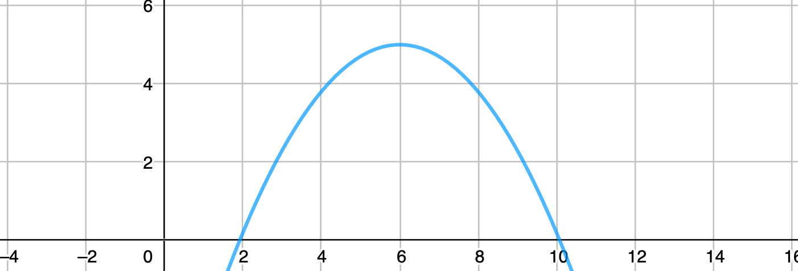
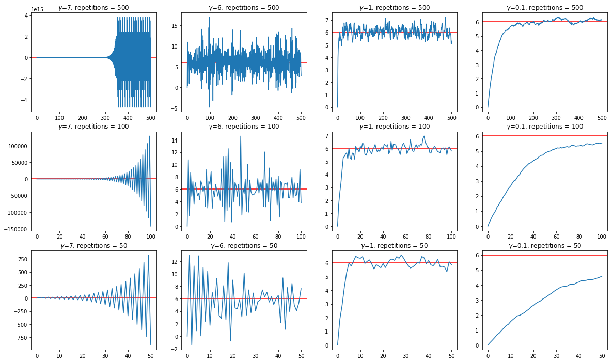
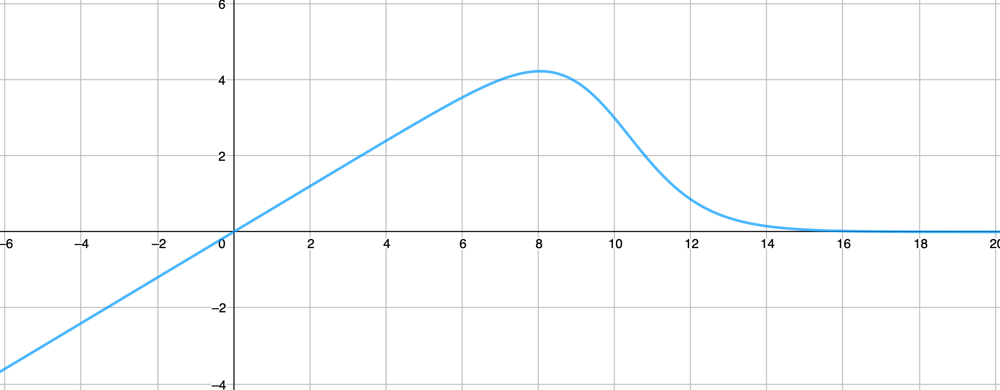
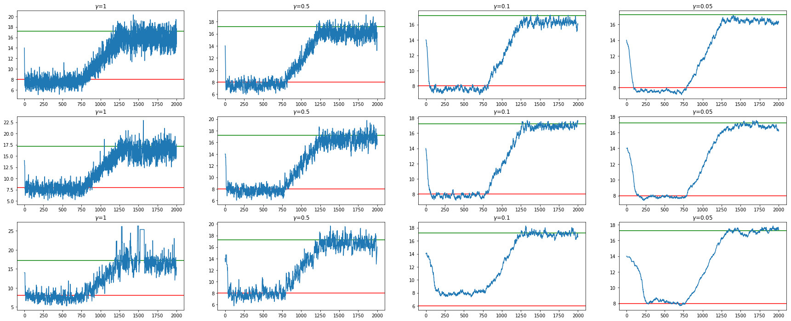

LockInFeedBack [](https://www.paypal.com/cgi-bin/webscr?cmd=_s-xclick&hosted_button_id=EFQXNQ7UYXYKW&source=url)
=======

[LockInFeedBack](https://github.com/thierrygrimm/LockInFeedback) shows a Lock-in Feedback algorithm (LiF) in action. A LiF algorithm is a noise and concept-drift (non-stationary) resistent stochastic optimization method for sequential experiments. 

## Organization
### Foundations 

**What is a lock in feedback algorithm?**
A LiF algorithm is a noise and concept-drift (non-stationary) resistent stochastic optimization method for sequential experiments. 

**What are its properties?**
adapts to changing optima (concept drift)
resistent to high degree of noise
designs experiments to gain maximal information (adaptive design optimization)
Receives bandit feedback (limited to the actions taken by the system) and decides what to ask/survey next - e.g. finding optimal prices through revenue signals in E-Tailer commerce
What parameters have to be set manually?
* Initial value 𝑥0
* Amplitude  𝐴
* Batch period length  𝑇
* Learning rate  𝛾

**How does the algorithm work?**
Discrete oscillations around a central value x0 as input for the experiments, observing the response y. If y in phase with oscillations around x increase xt, out of phase decrease xt

## Sections
### Illustrative Example
We introduce LiF with a simple parabolic function with a maximum at x=6 with added gaussian noise. The LiF updates are performed in batches of batch length T.


<p align="center">
  
</p>

The algorithm converges to the right value as long as the amplitude is set accordingly.

<p align="center">
  
</p>


### Dichotomous functions
In real-life signals and responses are often dichotomous (binary) such as with purchase decisions. Either a purchase is made or its not. LiF also converges in dichotomous scenarios such as for optimizing revenue by finding an optimal price. Here the purchase decision can only be binary.

<p align="center">
  
</p>

### Non-stationary Optima (concept drift)
In the real world, there must not be a single fixed optimum. Optima can be non-stationary. This is also known as concept-drift. LiF can handle it very well.

<p align="center">
  
</p>

## Issues

Found a bug? Want more features? Find something missing in the documentation? Let us know! Please don't hesitate to [file an issue](https://github.com/thierrygrimm/LockInFeedback/issues/new) and make a recommendation.

## License
```
LockInFeedback - Noise and concept-drift resistent stochastic optimization method for sequential experiments

The MIT License (MIT)

Copyright (c) 2020 Thierry Grimm

Permission is hereby granted, free of charge, to any person obtaining a copy
of this software ("LockInFeedback") and associated documentation files (the "Software"), to deal
in the Software without restriction, including without limitation the rights
to use, copy, modify, merge, publish, distribute, sublicense, and/or sell
copies of the Software, and to permit persons to whom the Software is
furnished to do so, subject to the following conditions:

The above copyright notice and this permission notice shall be included in
all copies or substantial portions of the Software.

THE SOFTWARE IS PROVIDED "AS IS", WITHOUT WARRANTY OF ANY KIND, EXPRESS OR
IMPLIED, INCLUDING BUT NOT LIMITED TO THE WARRANTIES OF MERCHANTABILITY,
FITNESS FOR A PARTICULAR PURPOSE AND NONINFRINGEMENT. IN NO EVENT SHALL THE
AUTHORS OR COPYRIGHT HOLDERS BE LIABLE FOR ANY CLAIM, DAMAGES OR OTHER
LIABILITY, WHETHER IN AN ACTION OF CONTRACT, TORT OR OTHERWISE, ARISING FROM,
OUT OF OR IN CONNECTION WITH THE SOFTWARE OR THE USE OR OTHER DEALINGS IN
THE SOFTWARE.
```

